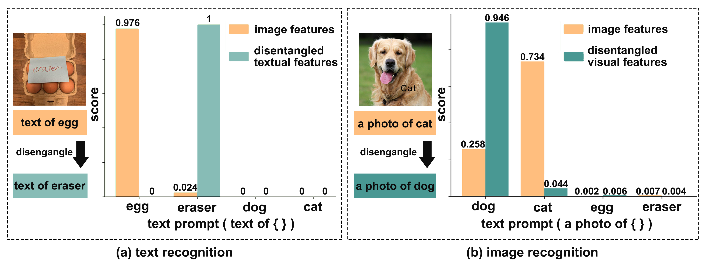

# CLIP in Mirror: Disentangling text from visual images through reflection
<p align="center">
  
</p>

This repository contains PyTorch implementation for our paper: CLIP in Mirror: Disentangling text from visual images
through reflection

## Abstract
The CLIP network excels in various tasks, but struggles with text-visual images i.e., images that contain both text and visual objects; it risks confusing textual and visual representations. To address this issue, we propose MirrorCLIP, a zero-shot framework, which disentangles the image features of CLIP by exploiting the difference in the mirror effect between visual objects and text in the images. Specifically, MirrorCLIP takes both original and flipped images as inputs, comparing their features dimension-wise in the latent space to generate disentangling masks. With disentangling masks, we further design filters to separate textual and visual factors more precisely, and then get disentangled representations. Qualitative experiments using stable diffusion models and class activation mapping (CAM) validate the effectiveness of our disentanglement. Moreover, our proposed MirrorCLIP reduces confusion when encountering text-visual images and achieves a substantial improvement on typographic defense, further demonstrating its superior ability of disentanglement.

### Demo

You can use the code below to run demos.

#### Parameters

-task include 'image' for image recognition and 'text' for text recognition.

-feat specifies the type of features, including 'textual' and 'visual'.

-image specifies the path of input image.

#### Examples

If you want to run a demo for image recognition with visual features, then run
```
python demo.py -task image -feat visual -image dog_cat.jpg
```

If you want to if you want to run a demo for image recognition with visual features, then run
```
python demo.py -task text -feat textual -image egg_eraser.jpg
```


### Evaluation
To reproduce the results of the paper, you can use the code below. 

#### Parameters

-dataset specifies the type of dataset used for evaluation, including 'synthetic', 'real-world' and 'text'.

-feat specifies the type of features used for evaluation, including 'origin', 'textual' and 'visual'.

-t means evaluate on typographic attack images or not.

#### Examples

If you want to evaluate on 3 real-world typographic attack datasets mentioned in our paper with disentangled visual features for image recognition, then run
```
python evaluate.py -dataset real-world -t -feat visual
```

If you want to evaluate on 10 original datasets mentioned in our paper with image features for image recognition, then run
```
python evaluate.py -dataset synthetic -feat origin
```

If you want to evaluate on 10 synthetic typographic attack datasets mentioned in our paper with disentangled visual features for image recognition, then run
```
python evaluate.py -dataset synthetic -t -feat visual
```

If you want to evaluate on typographic attack datasets mentioned in our paper with disentangled textual features for text recognition, then run
```
python evaluate.py -dataset text -t -feat textual
```

You can refer to dataset.py for other datasets
#### Real-world images
For images from [Materzynska et.al.(CVPR2022)](https://github.com/joaanna/disentangling_spelling_in_clip), [PAINT(Ilhalco+, NeurIPS2022)](https://github.com/mlfoundations/patching) and [Defense Prefix(Azuma+, ICCVW2023)](https://github.com/azuma164/Defense-Prefix) you can refer to each repository to download dataset.